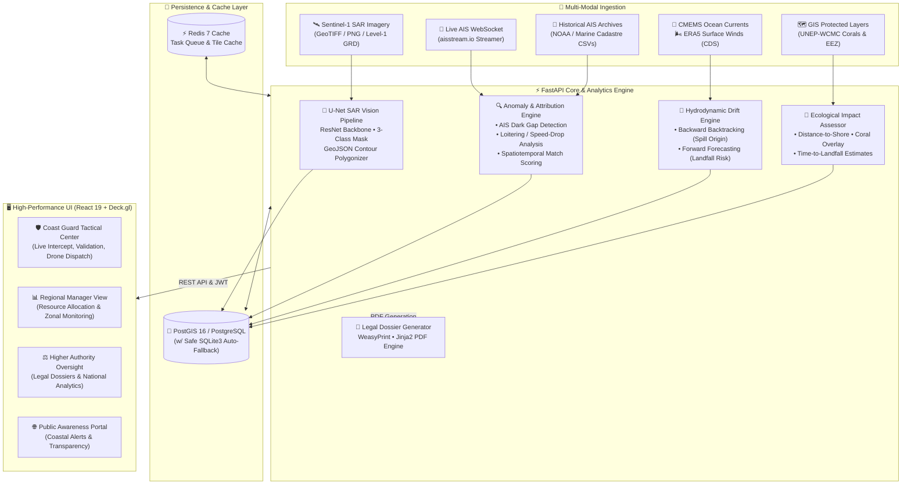

# 🌊 SARVAS: Satellite SAR Oil Spill Detection & AIS Vessel Attribution Platform

**SARVAS — From Slick to Suspect**

[](https://fastapi.tiangolo.com/)
[](https://react.dev/)
[](https://maplibre.org/)
[](https://pytorch.org/)
[](https://postgis.net/)
[](https://vitejs.dev/)
[](LICENSE)

> **SARVAS** (*Satellite Automated Reconnaissance & Vessel Attribution System*) is an end-to-end maritime intelligence platform combining Sentinel-1 SAR satellite computer vision, backward/forward hydrodynamic drift modeling, real-time AIS dark vessel tracking, sovereign EEZ territorial defense, NOS-DCP indicator species ecological risk matrices, and multi-tier command & control operational consoles.

---

## 📌 Executive Summary

Illegal marine oil discharge (bilge dumping, tank washing, and catastrophic accidental spills) severely threatens coastal ecosystems, coral reefs, and fisheries. Traditional detection workflows suffer from high false-positive rates (algal blooms, low-wind sea slicks), lack of forensic backtracking, and inability to correlate detected slicks with culprit vessels.

**SARVAS** bridges satellite Earth observation and maritime law enforcement into an automated, actionable surveillance pipeline:

1. **Detects & Segments** oil slicks from Synthetic Aperture Radar (SAR) imagery with deep learning U-Net models, discriminating true petroleum slicks from look-alikes.
2. **Backtracks Drift Trajectories** using ocean current and surface wind vectors to determine the precise spatiotemporal point of discharge.
3. **Identifies & Attributes Suspect Vessels** by ingesting live and historical AIS feeds, flagging dark ship anomalies (transponder blackouts, speed drops, sharp course deviations), and generating a ranked suspect score.
4. **Evaluates Marine Ecological Impact** against high-resolution spatial layers of coral reefs, mangroves, Marine Protected Areas (MPAs), and Exclusive Economic Zone (EEZ) boundaries.
5. **Interactive Sovereign Maritime GIS** with zero-collision labeling, regional raster tiles, and smooth zoom-out over sovereign waters and national port hubs.
6. **Empowers Multi-Agency Operations** through tailored role-based dashboards (Coast Guard, Regional Supervisors, Higher Maritime Authorities, and Public Safety) alongside court-ready PDF legal dossiers.

---

## 🏗️ System Architecture



---

## 🔑 Pre-Configured Demo Accounts

The platform includes 4 pre-configured role-based accounts ready for testing:

| Role | Username | Password | Default Dashboard | Key Capabilities |
| :--- | :--- | :--- | :--- | :--- |
| **Coast Guard Officer** | `coast_guard` | `demo123` | `/dashboard/coastguard` | Real-time tactical map, slick validation/override, suspect vessel inspection, live AIS tracks, drone dispatch |
| **Regional Manager** | `regional_mgr` | `demo123` | `/dashboard/regional` | Coastal surveillance, containment monitoring, clean-up resource distribution |
| **Higher Authority** | `authority` | `demo123` | `/dashboard/authority` | Executive national overview, multi-state risk breakdown, court-admissible PDF dossier export |
| **Public Observer** | `public_user` | `demo123` | `/` | Open citizen alerts, safety advisories, verified spill records |

---

## ⚡ Quickstart Guide

### Option 1: One-Click Launch with Docker Compose (Recommended)

Requires [Docker Desktop](https://www.docker.com/products/docker-desktop/):

```bash
# 1. Clone the repository
git clone <your-repo-url>
cd <repo-folder>

# 2. Build and launch all containers (PostGIS, Redis, FastAPI Backend, React Frontend)
docker compose up --build -d

# 3. Seed initial database (creates all tables, accounts, spills, vessels, tracks)
docker compose exec backend python -m scripts.seed_demo_data
```

Access the applications:
- 🌐 **Frontend Web App**: [http://localhost:5173](http://localhost:5173)
- ⚡ **Backend API & Swagger Docs**: [http://localhost:8000/docs](http://localhost:8000/docs)
- 🐘 **PostGIS Database**: `localhost:5432` (`oilspill` / `oilspill_dev`)

---

### Option 2: Local Bare-Metal Setup (Zero Docker Needed)

The platform features an **automatic SQLite fallback**. If PostgreSQL is not running on your machine, the backend will automatically initialize a local SQLite database (`oilspill.db`)!

#### 1. Backend Setup

```bash
cd backend

# Create and activate virtual environment
python -m venv venv
# Windows:
.\venv\Scripts\activate
# Linux/macOS:
source venv/bin/activate

# Install dependencies
pip install -r requirements.txt

# Create local environment config
cp .env.example .env

# Seed initial database (creates users, demo spills, vessels, and anomalies in 1 second)
python -m scripts.seed_demo_data

# Start the FastAPI development server
uvicorn app.main:app --host 0.0.0.0 --port 8000 --reload
```

#### 2. Frontend Setup

Open a new terminal window:

```bash
cd frontend

# Install Node dependencies
npm install

# Start Vite development server
npm run dev
```

Visit [http://localhost:5173](http://localhost:5173) in your browser.

---

## 💾 How Database Data is Handled

To prevent Git merge conflicts and keep development frictionless for all teammates:

1. **Why `*.db` is excluded from Git**:
   Binary SQLite files (`oilspill.db`) change on every user login, spill update, or session creation. Committing binary database files causes frequent Git conflicts and bloat.
2. **Instant 1-Second Database Seeding**:
   The `backend/scripts/seed_demo_data.py` script is fully idempotent and self-contained. Running:
   ```bash
   python -m scripts.seed_demo_data
   ```
   automatically:
   - Creates all database tables (compatible with both PostgreSQL/PostGIS and SQLite).
   - Hashes passwords and creates the 4 test users (`coast_guard`, `regional_mgr`, `authority`, `public_user`).
   - Inserts realistic detected oil spills (Mumbai Offshore, Gulf of Kutch, etc.) with coordinates, contours, and severity.
   - Populates commercial tankers, cargo vessels, AIS coordinate tracks, speed drop anomalies, and dark transponder blackout gaps.
   - Computes drift trajectories and coral reef vulnerability scores.

---

## 📦 Out-of-the-Box Data (Included in Repository)

The repository comes pre-packaged with all lightweight runtime assets (~73 MB total) so teammates can run the entire platform immediately with zero external downloads:

| Asset | Location | Size | Description |
| :--- | :--- | :--- | :--- |
| **India EEZ Layer** | `backend/data/gis/eez/india_eez.geojson` | 551 KB | Official Exclusive Economic Zone boundary for maritime jurisdiction |
| **India Coastline** | `backend/data/gis/coastline/india_coastline.geojson` | 786 KB | Coastal vectors for distance-to-shore and landfall calculations |
| **Coral Reef Systems** | `backend/data/gis/corals/coral_reefs.geojson` | 12.3 MB | UNEP-WCMC coral reef boundary polygons |
| **ERA5 Wind Field** | `backend/data/era5/era5_wind_india.nc` | 584 KB | Surface wind vectors for drift particle simulation |
| **U-Net Model Weights** | `backend/ml/models/unet_best.pth` | 54.7 MB | Pre-trained PyTorch U-Net neural network for SAR oil slick segmentation |
| **Judge Demo SAR Test Suite** | `backend/data/sar/demo_for_judges/` | ~3.5 MB | 6 real Sentinel-1 test scenes (major spills, moderate slicks, low-wind look-alikes) with ground-truth masks |

*For complete details on data sources, see [DATA_GUIDE.md](DATA_GUIDE.md).*

---

## 🛰️ Live Telemetry & Real-World Operations

### Streaming Live AIS Vessel Feeds
Stream real-time vessel traffic directly into the database from [aisstream.io](https://aisstream.io):
```bash
# 1. Add your free key in backend/.env:
# AISSTREAM_API_KEY=your_key_here

# 2. Run the live streamer:
python -m scripts.stream_ais --region west_coast
```

### Uploading & Segmenting SAR Imagery
Upload any Sentinel-1 SAR image (PNG, JPG, TIFF) via the web dashboard or CLI:
```bash
python -m scripts.ingest_real_data --sar "data/sar/demo_for_judges/demo_oil_spill_large.png" --lat 18.85 --lon 71.90 --region "west_coast"
```

---

## 🔌 API Reference Overview

Interactive Swagger documentation is available at [http://localhost:8000/docs](http://localhost:8000/docs).

| Method | Endpoint | Description |
| :--- | :--- | :--- |
| `POST` | `/api/auth/login` | Authenticate user & receive Bearer JWT token |
| `GET` | `/api/auth/me` | Fetch authenticated user profile and assigned role |
| `GET` | `/api/spills` | List detected oil spills with filtering (status, severity, region) |
| `POST` | `/api/spills/upload-sar` | Upload SAR image for automatic ML segmentation & polygonization |
| `POST` | `/api/spills/{id}/validate` | Validate or reject detected slick (Coast Guard role) |
| `GET` | `/api/vessels/{id}/tracks` | Retrieve temporal AIS coordinate history for a vessel |
| `GET` | `/api/drift/{id}/backward` | Retrieve 24h backtrack origin trajectory |
| `GET` | `/api/drift/{id}/forward` | Retrieve 48h forecasted dispersion & landfall path |
| `GET` | `/api/attribution/{id}/suspects` | Retrieve ranked suspect vessels with attribution scores |
| `GET` | `/api/attribution/anomalies/feed` | Real-time stream of detected vessel anomalies (dark gaps, speed drops) |
| `GET` | `/api/impact/{id}/assessment` | Ecological risk evaluation (coral reefs, coastline proximity) |
| `GET` | `/api/reports/{id}/pdf` | Generate and download official PDF investigation dossier |

---

## 🤝 Git Push & Team Workflow

To push this repository to GitHub/GitLab, see [GIT_PUSH_INSTRUCTIONS.md](GIT_PUSH_INSTRUCTIONS.md).

```bash
# 1. Initialize & stage
git init
git branch -M main
git add .
git commit -m "feat: initial commit of AegisOcean platform"

# 2. Add remote & push
git remote add origin https://github.com/<username>/<repo>.git
git push -u origin main
```

---

## 🛡️ License

This project is licensed under the **MIT License** — see the [LICENSE](LICENSE) file for details.