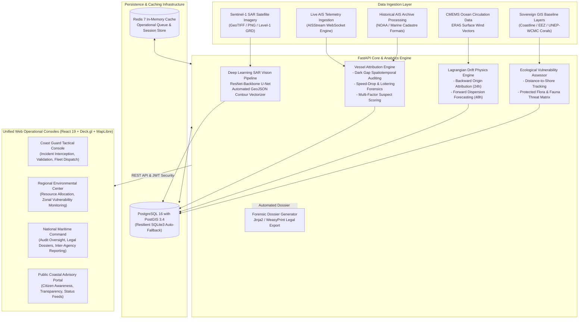

# SARVAS: Satellite SAR Oil Spill Detection and AIS Vessel Attribution Platform

**SARVAS -- From Slick to Suspect**

[](https://fastapi.tiangolo.com/)
[](https://react.dev/)
[](https://maplibre.org/)
[](https://pytorch.org/)
[](https://postgis.net/)
[](https://vitejs.dev/)
[](LICENSE)

> **SARVAS** (*Satellite Automated Reconnaissance and Vessel Attribution System*) is an enterprise-grade maritime surveillance and forensic intelligence platform. It fuses Sentinel-1 Synthetic Aperture Radar (SAR) computer vision, Lagrangian hydrodynamic drift backtracking, real-time Automatic Identification System (AIS) telemetry anomaly tracking, Exclusive Economic Zone (EEZ) sovereign boundary protection, and National Oil Spill Disaster Contingency Plan (NOS-DCP) ecological vulnerability matrices into unified, role-governed command centers.

---

## 1. Executive Summary

Unregulated maritime petroleum discharges--including illicit oily bilge flushing, crude tank washing, and catastrophic marine collisions--inflict severe ecological and financial destruction upon coastal shelf environments, mangrove networks, and protected fisheries. Conventional aerial and manual monitoring workflows are severely constrained by high false-alarm rates (biogenic slicks, calm water look-alikes), absence of physical backtracking physics, and the operational inability to correlate radar slicks with culprit vessels operating in stealth or transponder-denied environments.

**SARVAS** establishes an autonomous, forensic pipeline bridging spaceborne Earth observation sensors and maritime law enforcement:

1. **Synthetic Aperture Radar Segmentation**: Deploys deep residual U-Net architectures trained on calibrated Sentinel-1 C-band SAR Level-1 Ground Range Detected (GRD) imagery to segment true mineral oil slicks while rejecting look-alikes.
2. **Lagrangian Hydrodynamic Drift Reconstruction**: Executes backward temporal trajectories driven by CMEMS ocean surface currents and ECMWF ERA5 10-meter wind fields to determine spatiotemporal discharge origin coordinates.
3. **AIS Vessel Attribution & Dark Anomaly Analysis**: Correlates candidate ship trajectories against discharge zones, auditing transponder blackouts, speed-drop signatures, and loitering maneuvers to compute auditable attribution scores.
4. **Sovereign Maritime Domain Awareness & GIS**: Leverages high-precision sovereign baselines, 12-nautical-mile territorial limits, 200-nautical-mile EEZ perimeters, and zero-collision dynamic cartographic labeling over national sea lanes.
5. **Ecosystem & NOS-DCP Sensitivity Evaluation**: Assesses spill vector proximities against UNEP-WCMC coral coordinates, Marine Protected Areas (MPAs), and classified bio-indicator species.
6. **Multi-Tier Command Interoperability**: Furnishes distinct operational workspaces for tactical field interdictors, regional environmental coordinators, national oversight executives, and public coastal advisory portals.

---

## 2. System Architecture



---

## 3. Role-Based Access Control (RBAC) Specifications

SARVAS enforces strict role segregation across four operational command tiers:

| Operational Role | Identifier | Password | Designated Route | Core Responsibilities |
| :--- | :--- | :--- | :--- | :--- |
| **Tactical Interceptor (Coast Guard)** | `coast_guard` | `demo123` | `/dashboard/coastguard` | Real-time tactical radar plot, slick verification, AIS dark track scrutiny, patrol vessel dispatch, and drone reconnaissance. |
| **Regional Environmental Director** | `regional_mgr` | `demo123` | `/dashboard/regional` | Coastline containment coordination, booms and skimmer deployment, regional shoreline defense, and clean-up logistics. |
| **National Maritime Executive** | `authority` | `demo123` | `/dashboard/authority` | Comprehensive jurisdictional oversight, multi-state risk assessments, inter-agency reporting, and court-ready PDF dossier approvals. |
| **Public Information Officer / Citizen** | `public_user` | `demo123` | `/` | Transparency portal, public coastal safety advisories, verified cleanup statuses, and citizen observation logs. |

---

## 4. Installation and Deployment

### Option A: Automated Containerized Deployment (Docker Compose)

Prerequisites: Docker Engine 24.0+ and Docker Compose v2.

```bash
# 1. Clone the repository
git clone https://github.com/VaishnaviPatil-gif/Sarvas.git
cd Sarvas

# 2. Build and launch infrastructure services
docker compose up --build -d

# 3. Seed demo fixtures, vessels, spatial layers, and user credentials
docker compose exec backend python -m scripts.seed_demo_data
```

Active Endpoints:
- Web Application Console: `http://localhost:5173`
- Backend REST API & OpenAPI Documentation: `http://localhost:8000/docs`
- PostGIS Spatial Database: `localhost:5432` (`oilspill` / `oilspill_dev`)

---

### Option B: Local Bare-Metal Setup

The platform includes an automated SQLite persistence fallback. If PostgreSQL/PostGIS is absent, the backend safely routes operations to a local file-based database (`oilspill.db`).

#### 1. Backend Service Configuration

```bash
cd backend

# Initialize and activate Python virtual environment
python -m venv venv
# On Windows (PowerShell / Command Prompt):
.\venv\Scripts\activate
# On Linux / macOS:
source venv/bin/activate

# Install core dependencies
pip install -r requirements.txt

# Provision environment configuration
copy .env.example .env

# Run database migrations and seed operational baseline data
python -m scripts.seed_demo_data

# Launch FastAPI development server
uvicorn app.main:app --host 0.0.0.0 --port 8000 --reload
```

#### 2. Frontend Application Setup

In a separate terminal window:

```bash
cd frontend

# Install Node.js package dependencies
npm install

# Start Vite compilation server
npm run dev
```

Navigate to `http://localhost:5173` in any modern web browser.

---

## 5. Persistence Architecture and Data Management

To ensure deterministic deployment, high developer velocity, and zero repository bloating:

1. **Database Decoupling**: Binary SQLite and database instance states (`*.db`) are excluded from source control. All database structures are provisioned dynamically upon startup.
2. **Idempotent Seeding Pipeline**: The script `backend/scripts/seed_demo_data.py` can be executed repeatedly without generating duplicate state:
   ```bash
   python -m scripts.seed_demo_data
   ```
   Execution automatically:
   - Provisions database schemas compatible across PostgreSQL/PostGIS and SQLite.
   - Hashes credentials with bcrypt and assigns role records.
   - Ingests synthetic and real-world radar detections (Mumbai Offshore, Gulf of Kutch, Palk Strait) with vector boundary polygons.
   - Populates commercial vessel profiles, trajectory coordinates, transponder interruption gaps, and course deviations.
   - Pre-computes forward/backward dispersion curves and sensitivity indices.

---

## 6. Embedded Geospatial and Machine Learning Assets

The platform repository includes self-contained geospatial vector assets and pre-trained neural network weights (~73 MB total):

| Component | Storage Path | Size | Description |
| :--- | :--- | :--- | :--- |
| **Sovereign EEZ Boundaries** | `backend/data/gis/eez/india_eez.geojson` | 551 KB | Complete 200-nautical-mile Exclusive Economic Zone delineation. |
| **Sovereign Coastline Matrix** | `backend/data/gis/coastline/india_coastline.geojson` | 786 KB | High-resolution coastal vectors for distance-to-shore analytics. |
| **Coral Reef Systems** | `backend/data/gis/corals/coral_reefs.geojson` | 12.3 MB | UNEP-WCMC global protected reef vector polygons. |
| **ERA5 Atmospheric Wind Field** | `backend/data/era5/era5_wind_india.nc` | 584 KB | NetCDF surface wind field for Lagrangian drift advection. |
| **U-Net Deep Vision Model** | `backend/ml/models/unet_best.pth` | 54.7 MB | PyTorch neural network checkpoint for multi-class SAR oil segmentation. |
| **Evaluation Test Scenes** | `backend/data/sar/demo_for_judges/` | ~3.5 MB | Curated Sentinel-1 SAR scenes featuring verified oil spills and look-alikes. |

---

## 7. Real-World Live Telemetry Ingestion

### Live AIS Data Streaming
Stream live commercial vessel telemetry directly into the analytical store via AISStream:
```bash
# Set your API token inside backend/.env:
# AISSTREAM_API_KEY=your_registered_token

# Initiate the continuous streaming worker:
python -m scripts.stream_ais --region west_coast
```

### Manual SAR Scene Processing
Process and segment custom radar acquisitions from command line or web interface:
```bash
python -m scripts.ingest_real_data --sar "data/sar/demo_for_judges/demo_oil_spill_large.png" --lat 18.85 --lon 71.90 --region "west_coast"
```

---

## 8. REST API Specification

Detailed OpenAPI 3.0 documentation is accessible at `http://localhost:8000/docs`.

| HTTP Verb | Resource Path | Description | Access Scope |
| :--- | :--- | :--- | :--- |
| `POST` | `/api/auth/login` | Authenticate credentials and generate JWT token. | Public |
| `GET` | `/api/auth/me` | Retrieve profile and assigned role permissions. | Authenticated |
| `GET` | `/api/spills` | Query oil spill incidents filtered by status, region, or risk. | Authenticated |
| `POST` | `/api/spills/upload-sar` | Ingest SAR raster for automated neural network segmentation. | Operator / Interceptor |
| `POST` | `/api/spills/{id}/validate` | Submit formal verification or rejection of an automated detection. | Coast Guard |
| `GET` | `/api/vessels/{id}/tracks` | Query historical AIS spatiotemporal trajectory vectors. | Authenticated |
| `GET` | `/api/drift/{id}/backward` | Retrieve 24-hour backward hydrodynamic drift trajectory. | Authenticated |
| `GET` | `/api/drift/{id}/forward` | Retrieve 48-hour forward dispersion forecast and landfall risk. | Authenticated |
| `GET` | `/api/attribution/{id}/suspects`| Return ranked candidate vessels with forensic confidence scores. | Authenticated |
| `GET` | `/api/attribution/anomalies/feed` | Stream real-time detected AIS transponder gaps and speed drops. | Authenticated |
| `GET` | `/api/impact/{id}/assessment` | Compute spatial vulnerability against coastline and coral layers. | Authenticated |
| `GET` | `/api/reports/{id}/pdf` | Generate cryptographic, court-admissible PDF investigation dossier. | Authority / Executive |

---

## 9. Code Quality and Testing Standards

Ensure system integrity by running the test suite prior to deployment:

```bash
# Run backend unit, integration, and ML inference tests
cd backend
pytest tests/ -v

# Run frontend production bundle validation
cd ../frontend
npm run build
```

---

## 10. License and Governance

This project is licensed under the **MIT License**. Refer to the [LICENSE](LICENSE) file for complete terms and governance.